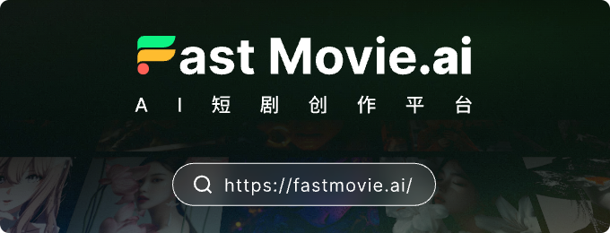
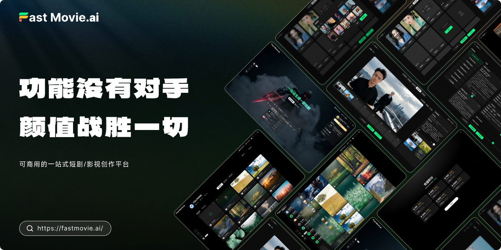

<div align="center">



# FastMovieAI

**Commercial-Ready All-in-One Short Drama Creation Platform**

[Live Demo](https://fastmovie.ai) | [Official Website](https://www.fastmovieai.com) | [简体中文](./README.md)


</div>

---

## 📖 Introduction

FastMovieAI is a feature-complete open-source short drama/video creation platform with a decoupled frontend-backend architecture, providing AI-driven video content creation capabilities. The platform integrates user management, payment systems, content management, video generation, and other complete functional modules, suitable for content creators and video production teams.

## 🎯 Our Vision

FastMovieAI is committed to building the **world's leading open-source short drama creation ecosystem**, comprehensively benchmarking against industry-leading commercial short drama creation platforms such as SenseTime Seko, Huanzhou, Jurilou, Kemeng, Oii, Mashu, Flova, Baidu Intelligent Creation, Volcano Engine, and Alibaba Cloud Video AI.

### Why Choose FastMovieAI?

🌟 **True Open Source Freedom** - Unlike closed-source commercial platforms' black-box operations, we provide completely open source code, allowing every developer to deeply customize and redevelop to create their own exclusive short drama creation tools.

💰 **Zero-Cost Commercial Use** - No need to pay expensive SaaS subscription fees, no worries about astronomical pay-as-you-go bills. Deploy once, use forever, truly achieving cost reduction and efficiency improvement.

🚀 **Continuous Evolution** - We believe in the power of open source. Through community-driven approaches, we rapidly iterate features and respond to user needs, keeping the platform technologically advanced.

🤝 **Co-Creation and Win-Win** - We sincerely invite film production companies, short drama teams, MCN agencies, independent creators, and technical developers to join our ecosystem, polish product details together, share industry experience, and make FastMovieAI a tool that truly understands creators.

### Our Commitments

- ✅ **Open and Transparent** - All code is open source, all decisions are public, subject to community supervision
- ✅ **User First** - Take every feedback seriously, respond quickly to every need
- ✅ **Technological Leadership** - Keep up with AI technology frontiers, continuously introduce the latest video generation, voice synthesis, and intelligent editing capabilities
- ✅ **Ecosystem Co-construction** - Provide comprehensive plugin mechanisms, support third-party developers to contribute functional modules
- ✅ **Long-term Maintenance** - Commit to long-term maintenance and updates, will not abandon the open-source version due to commercialization

### Join Us

Whether you are:
- 🎬 **Film Companies** - Seeking solutions to reduce production costs and improve creative efficiency
- 📱 **Short Drama Teams** - Need batch and industrialized content production tools
- 🎨 **Individual Creators** - Independent producers who want to realize creative ideas at low cost
- 💻 **Technical Developers** - Engineers interested in AI video technology

We welcome you to join! Let's use the power of open source to redefine the future of short drama creation and enable everyone to become an excellent content creator!

<div align="center">
  
</div>

### ✨ Core Features

- 🎬 **AI Video Creation** - AI-based short drama video generation and editing capabilities
- 🎭 **Character Management** - Virtual character creation, configuration, and management
- 🎙️ **Voice Synthesis** - Multi-language voice synthesis and dubbing functions
- 📝 **Script Editing** - Visual script editor and storyboard management
- 💰 **Payment Integration** - Support for Alipay, WeChat Pay, and other payment methods
- 👥 **User System** - Complete user registration, login, and VIP membership system
- 💎 **Points System** - Flexible points recharge and consumption mechanism
- 📱 **WeChat Integration** - Support for WeChat Official Account and Mini Program integration
- 🔌 **Plugin Architecture** - Modular plugin system, easy to extend
- 🌍 **Multi-language Support** - Chinese and English interface switching

### 🎯 Use Cases

- Short video content creation platform
- AI-driven video production tools
- Short drama creation and distribution system
- Content creator community platform

## 🏗️ Technical Architecture

### Backend Stack

- **Framework**: Webman v2.1+ (High-performance PHP framework based on Workerman)
- **PHP Version**: ≥8.1
- **Database**: MySQL ≥8.0, Redis
- **ORM**: ThinkORM v2.1+
- **Template Engine**: ThinkTemplate v3.0+
- **Payment**: Yansongda/Pay v3.7+ (Alipay, WeChat Pay)
- **Video Processing**: php-ffmpeg v1.3+
- **WebSocket**: webman/push v1.1+

### Frontend Stack

- **Framework**: Vue 3.5+ (Composition API)
- **Build Tool**: Vite 7.1+
- **Language**: TypeScript 5.9+
- **UI Framework**: Element Plus 2.11+
- **State Management**: Pinia 3.0+
- **Router**: Vue Router 4.5+
- **Video Processing**: @webav/av-cliper, mp4box

### Project Structure

```
fastmovieai/
├── fastmovie-admin/    # Backend application (PHP/Webman)
│   ├── app/           # Application code
│   ├── config/        # Configuration files
│   ├── plugin/        # Plugin system
│   ├── public/        # Public resources
│   └── start.php      # Entry point
├── fastmovie-vue/     # Frontend application (Vue3/TypeScript)
│   ├── src/          # Source code
│   ├── public/       # Static resources
│   └── vite.config.ts # Vite configuration
└── README.md         # Project documentation
```

## 📦 Requirements

### Backend Requirements

- PHP ≥ 8.1
- MySQL ≥ 8.0
- Redis
- Required PHP Extensions:
  - PDO, PDO_MySQL, MySQLi
  - Redis
  - cURL, OpenSSL
  - GD, Fileinfo
  - MBString, JSON
  - Event (recommended for better performance)

### Frontend Requirements

- Node.js (LTS version recommended)
- npm or yarn

## 🚀 Quick Start

### 1. Clone the Project

This project consists of two independent Git repositories that need to be cloned separately:

```bash
# Create project directory
mkdir fastmovieai
cd fastmovieai

# Clone backend repository
git clone https://gitee.com/yc_open/ai-short-play.git fastmovie-admin

# Clone frontend repository
git clone https://gitee.com/yc_open/ai-short-play-vue.git fastmovie-vue
```

After cloning, the directory structure will be:
```
fastmovieai/
├── fastmovie-admin/    # Backend repository
└── fastmovie-vue/      # Frontend repository
```

### 2. Backend Installation

#### Using Web Installation Wizard (Recommended)

**Step 1: Configure Site**

If using BT Panel:
1. Create a site and set the root directory to `fastmovie-admin/public`
2. Select PHP version 8.1 or higher

**Step 2: Access Installation Wizard**

Visit `http://your-domain.com/install` and follow the wizard to complete installation:

1. **License Agreement** - Read and agree to the open source license
2. **Environment Check** - Automatically detect PHP version, extensions, permissions, etc.
3. **Parameter Configuration** - Configure database and Redis connection, set admin account
4. **Start Installation** - Automatically complete database initialization and configuration file generation

**After Installation:**

The installation wizard will automatically complete the following tasks:
- Generate `.env` configuration file (based on `.env.example`)
- Automatically configure database connection pool parameters
- Generate random PUSH_KEY and PUSH_SECRET (32-character strings)
- Synchronize and update PUSH_KEY in `nginx.example`
- Create `install.lock` file to prevent duplicate installation

After installation, the page will prompt you to complete the following operations:

**1. Configure URL Rewrite Rules**
- Copy the entire content of `fastmovie-admin/nginx.example` file
- Paste and save in BT Panel's "Site Settings → URL Rewrite"
- PUSH_KEY has been automatically updated to the actual generated random value

**2. Start Backend Service**
```bash
cd fastmovie-admin
php start.php start -d
```
Or configure process daemon in BT Panel (recommended)

**3. Delete Installation Directory**
```bash
# Delete installation directory (Important!)
rm -rf public/install
```

⚠️ **Important Notes**:
- Change the default admin password immediately after first login
- Ensure `.env` file permissions are secure and not exposed to the public
- `install.lock` file is used to prevent duplicate installation, do not delete

#### Manual Installation (Advanced Users)

If not using the Web installation wizard, you can configure manually:

```bash
cd fastmovie-admin

# 1. Copy environment configuration file
copy .env.example .env

# 2. Edit .env file and configure the following:
# Database configuration
# - DATABASE_HOST=127.0.0.1
# - DATABASE_PORT=3306
# - DATABASE_NAME=your_database
# - DATABASE_USERNAME=your_username
# - DATABASE_PASSWORD=your_password
# - DATABASE_PREFIX=php_
# 
# Database connection pool configuration (required)
# - DATABASE_MAX_CONNECTIONS=10
# - DATABASE_MIN_CONNECTIONS=1
# - DATABASE_WAIT_TIMEOUT=3
# - DATABASE_IDLE_TIMEOUT=60
# - DATABASE_HEARTBEAT_INTERVAL=50
#
# Redis configuration
# - REDIS_HOST=127.0.0.1
# - REDIS_PORT=6379
# - REDIS_PASSWORD=
# - REDIS_DATABASE=2
#
# WebSocket push configuration
# - PUSH_KEY=generate 32-character random string
# - PUSH_SCERET=generate 32-character random string
# - PUSH_API_PORT=37000
# - PUSH_WSS_PORT=37001

# 3. Import database
mysql -u root -p your_database < database.sql

# 4. Update PUSH_KEY in nginx.example
# Replace /app/PUSH_KEY with /app/your_actual_PUSH_KEY_value
```

### 3. Frontend Installation

```bash
cd fastmovie-vue

# Install dependencies
npm install

# Configure backend API address
# Edit .env.development file, set VITE_API_URL
```

### 4. Start Services

**Backend Service**

```bash
cd fastmovie-admin

# Development mode
php start.php start

# Daemon mode (production)
php start.php start -d

# Stop service
php start.php stop

# Restart service
php start.php restart

# Check status
php start.php status
```

**Frontend Service**

```bash
cd fastmovie-vue

# Start development server (default port 36310)
npm run dev

# Build for production
npm run build
```

### 5. Access the System

- **Frontend**: http://localhost:36310
- **Backend API**: http://localhost:36999
- **Default Admin Account**: admin
- **Default Password**: 123456

⚠️ **Security Notice**: Please change the default password immediately after first login!

## 🔧 Production Deployment

### BT Panel Deployment (Recommended)

1. **Create Site**
   - Create a new site in BT Panel
   - Set site root directory to `fastmovie-admin/public`
   - Configure PHP version to 8.1 or higher

2. **Configure URL Rewrite**

Add URL rewrite rules in site settings:

```nginx
location / {
    try_files $uri $uri/ /index.php?$query_string;
}
```

3. **Start Backend Service**

```bash
cd /www/wwwroot/your-site/fastmovie-admin
php start.php start -d
```

4. **Configure Process Daemon**

Add in BT Panel's "Process Daemon":
- Name: FastMovieAI
- Start Command: `cd /www/wwwroot/your-site/fastmovie-admin && php start.php start`
- Working Directory: `/www/wwwroot/your-site/fastmovie-admin`

5. **Access Installation Wizard**

Visit `http://your-domain.com/install` to complete installation configuration.

### Manual Deployment

#### Backend Deployment

1. **Configure Nginx Reverse Proxy**

Refer to `fastmovie-admin/nginx.example` configuration file:

```nginx
upstream fastmovie {
    server 127.0.0.1:36999;
    keepalive 10240;
}

server {
    listen 80;
    server_name your-domain.com;
    root /path/to/fastmovie-admin/public;

    location / {
        proxy_pass http://fastmovie;
        proxy_set_header Host $host;
        proxy_set_header X-Real-IP $remote_addr;
        proxy_set_header X-Forwarded-For $proxy_add_x_forwarded_for;
    }
}
```

2. **Start Backend Service**

```bash
cd fastmovie-admin
php start.php start -d
```

3. **Configure Process Daemon**

Use systemd or supervisor to manage processes and ensure automatic service restart.

#### Frontend Deployment

1. **Build for Production**

```bash
cd fastmovie-vue
npm run build
```

2. **Deploy Build Files**

After building, deploy the generated files to the `fastmovie-admin/public/assets/` directory, or configure an independent static file server.

3. **Configure Nginx**

```nginx
server {
    listen 80;
    server_name your-domain.com;
    root /path/to/fastmovie-admin/public;
    index index.html;

    location / {
        try_files $uri $uri/ /index.html;
    }

    location /api {
        proxy_pass http://127.0.0.1:36999;
    }
}
```

## 📚 Documentation

### Development Documentation

- [Backend Development Guide](./docs/backend-development.md) - PHP/Webman backend development guide
- [Frontend Development Guide](./docs/frontend-development.md) - Vue3/TypeScript frontend development guide

### Plugin System

FastMovieAI adopts a modular plugin architecture. Core plugins include:

- **user** - User management and authentication
- **finance** - Payment and financial management
- **marketing** - Marketing and promotion tools
- **article** - Content management system
- **shortplay** - Short drama creation core functionality
- **model** - AI model management
- **notification** - Notification and message push
- **control** - Platform control and configuration

Each plugin is an independent functional module that can be enabled or disabled as needed.

### Common Commands

**Backend Commands**

```bash
# View all commands
php webman

# Database migration (if supported)
php webman migrate

# Clear cache
php webman cache:clear
```

**Frontend Commands**

```bash
# Development server
npm run dev

# Production build
npm run build

# Preview build result
npm run preview

# Type checking
vue-tsc --noEmit
```

### Port Configuration

- **Backend Service**: 36999 (configurable via SERVER_PORT in .env)
- **Frontend Development**: 36310
- **WebSocket Push**: 37000
- **WebSocket WSS**: 37001

## 🤝 Contributing

We welcome all forms of contribution, including but not limited to:

1. 🐛 Submit bug reports
2. 💡 Propose new feature suggestions
3. 📝 Improve documentation
4. 🔧 Submit code fixes or new features

### Contribution Process

1. Fork the corresponding repository (backend or frontend)
2. Create a feature branch (`git checkout -b feature/AmazingFeature`)
3. Commit your changes (`git commit -m 'Add some amazing feature'`)
4. Push to the branch (`git push origin feature/AmazingFeature`)
5. Submit a Pull Request

**Note**: Backend and frontend are independent repositories. Please submit PRs to the corresponding repository based on your changes.

### Development Guidelines

- Backend code follows PSR-12 coding standards
- Frontend code uses ESLint and Prettier formatting
- Commit messages should clearly describe changes
- Add necessary code comments and documentation

## 📄 License

This project is licensed under the [Apache License 2.0](./LICENSE).

## 🔗 Links

- [Live Demo](https://fastmovie.ai)
- [Backend Repository (Gitee)](https://gitee.com/yc_open/ai-short-play)
- [Frontend Repository (Gitee)](https://gitee.com/yc_open/ai-short-play-vue)
- [Backend Development Guide](./docs/backend-development.md)
- [Frontend Development Guide](./docs/frontend-development.md)
- [Issue Tracker](https://gitee.com/yc_open/ai-short-play/issues)

## ⚠️ Disclaimer

This project is for learning and research purposes only. Users are responsible for all consequences arising from the use of this project. Please comply with relevant laws and regulations and do not use it for illegal purposes.

## 💬 Contact

For questions or suggestions, please contact us through:

- Submit Issue: 
  - Backend issues: [ai-short-play Issues](https://gitee.com/yc_open/ai-short-play/issues)
  - Frontend issues: [ai-short-play-vue Issues](https://gitee.com/yc_open/ai-short-play-vue/issues)
- Email: 416716328@qq.com
- Live Demo: [https://fastmovie.ai](https://fastmovie.ai)

### Join the Community

<div align="center">

<table>
  <tr>
    <td align="center">
      
      <br />
      <b>User Community</b>
      <br />
      <span>Scan to join and communicate with creators</span>
    </td>
    <td align="center">
      
      <br />
      <b>Technical Consultation & Business Cooperation</b>
      <br />
      <span>Scan to contact for cooperation</span>
    </td>
  </tr>
</table>

</div>

---

<div align="center">

**If this project helps you, please give us a ⭐️ Star!**

Made with ❤️ by FastMovieAI Team

</div>
